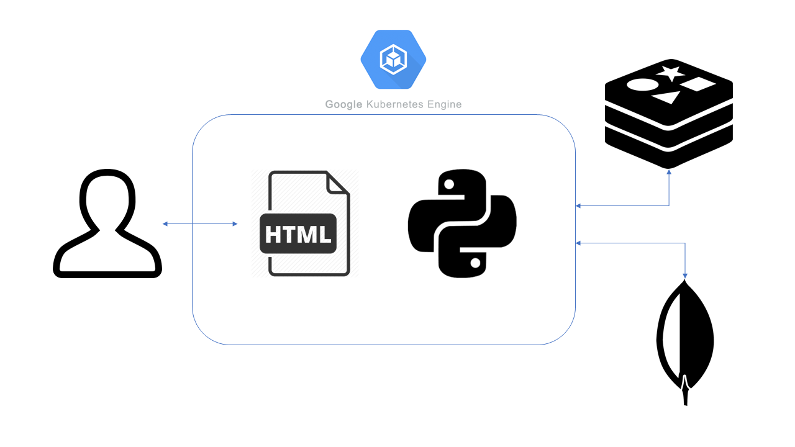

# TC3041 Proyecto  Final Primavera 2019

#LinkedOut
---

##### Integrantes:
1. Manuel Guadarrama
2. Pablo Teran


---
## 1. Aspectos generales

### 1.1 Requerimientos técnicos

A continuación se mencionan los requerimientos técnicos mínimos del proyecto, favor de tenerlos presente para que cumpla con todos.

* El equipo tiene la libertad de elegir las tecnologías de desarrollo a utilizar en el proyecto, sin embargo, debe tener presente que la solución final se deberá ejecutar en una plataforma en la nube. Puede ser  [Google Cloud Platform](https://cloud.google.com/?hl=es), [Azure](https://azure.microsoft.com/en-us/) o AWS [AWS](https://aws.amazon.com/es/free/).
* El proyecto debe utilizar al menos dos modelos de bases de datos diferentes, de los estudiados en el curso.
* La solución debe utilizar una arquitectura de microservicios. Si no tiene conocimiento sobre este tema, le recomiendo la lectura [*Microservices*](https://martinfowler.com/articles/microservices.html) de [Martin Fowler](https://martinfowler.com).
* La arquitectura debe ser modular, escalable, con redundancia y alta disponibilidad.
* La arquitectura deberá estar separada claramente por capas (*frontend*, *backend*, *API RESTful*, datos y almacenamiento).
* Los diferentes componentes del proyecto (*frontend*, *backend*, *API RESTful*, bases de datos, entre otros) deberán ejecutarse sobre contenedores [Docker](https://www.docker.com/) y utilizar [Kubernetes](https://kubernetes.io/) como orquestador.
* Todo el código, *datasets* y la documentación del proyecto debe alojarse en un repositorio de GitHub siguiendo al estructura que aparece a continuación.

### 1.2 Estructura del repositorio
El proyecto debe seguir la siguiente estructura de carpetas:
```
- / 			        # Raíz de todo el proyecto
    - README.md			# Archivo con los datos del proyecto (este archivo)
    - frontend			# Carpeta con la solución del frontend (Web app)
    - backend			# Carpeta con la solución del backend (CMS)
    - api			# Carpeta con la solución de la API
    - datasets		        # Carpeta con los datasets y recursos utilizados (csv, json, audio, videos, entre otros)
    - dbs			# Carpeta con los modelos, catálogos y scripts necesarios para generar las bases de datos
    - models			# Carpeta donde se almacenarán los modelos de Machine Learning ya entrenados
    - docs			# Carpeta con la documentación del proyecto
        - stage_f               # Documentos de la entrega final
        - manuals               # Manuales y guías
```

### 1.3 Documentación  del proyecto

Como parte de la entrega final del proyecto, se debe incluir la siguiente información:

* Justificación de los modelo de *bases de datos* que seleccionaron.
* Descripción del o los *datasets* y las fuentes de información utilizadas.
* Guía de configuración, instalación y despliegue de la solución en la plataforma en la nube  seleccionada.
* Documentación de la API. Puede ver un ejemplo en [Swagger](https://swagger.io/).
* El código debe estar documentado siguiendo los estándares definidos para el lenguaje de programación seleccionado.

## 2. Descripción del proyecto

El proyecto consiste en una aplicación web que obtiene y modifica información de una base de datos MongoDB para desplegar un sitio en dónde puedes ver tu información al igual que la de tus conocidos; este sitio ofrece un sistema de búsqueda en el que puedes encontrar a más de tus conocidos y ver su información básica permitiendo que conectes con más usuarios.

## 3. Solución

A continuación aparecen descritos los diferentes elementos que forman parte de la solución del proyecto.

### 3.1 Modelos de *bases de datos* utilizados

Se utilizó una Redis para el manejo o control de sesiones por su facilidad ya que al ser una base de datoa llave valor podemos guardar los dos datos importantes que son el usuario y la contraseña sin problemas y acceder a ellos rápidamente.

En cuanto a MongoDB, se utilizó porque no se tiene que definir los atributos que va a tener la basea de datos haciendo que se puedan agregar de ser necesario nuevos campos para los usuarios. También se utilizó por su compatibilidad con Python (Pymongo) ya que facilitó las consultas y actualizaciones a la base de datos desde el sitio web.

### 3.2 Arquitectura de la solución


### 3.3 Frontend
El frontend consiste en archivos HTML donde se utiliza CSS, JS y Bootstrap. Los archivos fueron descargados como una plantilla y modificados para que hagan exactamente lo que queremos en este proyecto. El uso de plantillas permite ahorrar tiempo y enfocar mas recursos en la creacion de backnd.

#### 3.3.1 Lenguaje de programación
Se utlizo HTML y JavaScript en los archivos .html.

#### 3.3.2 Framework
El framework utilizado fue [Flask](http://flask.pocoo.org/docs/1.0/). Flask hace la coneccion con el back end y con los archivos html.

#### 3.3.3 Librerías de funciones o dependencias
1.Flask
2.Bootstrap


### 3.4 Backend

El backend consiste de las dos bases de datos, una en MongoDB y la otra en Redis.
-   MongoDB por la facilidad de guardar los atributos y crear nuevos de ser necesarios, no se necesita definir todo al inicio. Se pueden insertar nuevos campos o "documentos" de acuerdo a lo que se necesite en el sitio web.
-   Redis por ser llave valor se guardan los dos datos del login del usuario y es fácil comprobar y autenticar las sesiones.

#### 3.4.1 Lenguaje de programación
Se utilizó Python para lograr la comunicación con las bases de datos.
#### 3.4.2 Framework
1. MongoDB
2. Redis
#### 3.4.3 Librerías de funciones o dependencias
1. Redis
2. MongoClient:Pymongo

### 3.5 API

Para la comunicación entre Backend y el Frontend se utilizó el framework Flask en conjunto con Python, dependiendo de a que parte de la aplicación accedía (login, register, index) se realizaban diferentes queries para obtener y desplegar la información, de ser necesario también se puede modificar la información como es el caso de registrar un nuevo usuario.

#### 3.5.1 Lenguaje de programación
Se utilizó [Python](https://docs.python.org/3/) para el API de la aplicación web. 

#### 3.5.2 Framework
[Flask](http://flask.pocoo.org/)

#### 3.5.3 Librerías de funciones o dependencias
ENTRY POINT: "/"
* **Descripción**: la página principal de nuestro sitio web es la del login del usuario por lo que al lanzar la aplicación se despliega el template de login.html
* **URL**: "/"

END POINT: "/login"
* **Descripción**: pide al usuario un username y password válido para acceder al sitio web completo en dónde se despliega tu información y están las otras funciones. Si se llena correctamente, es decir, si se autentifica al usuario damos paso a la pantalla de index.html
* **URL**: "/login"

END POINT: "/register"
* **Descripción**: si no se tiene una cuenta válida se le pide al usuario dar los datos necesarios para darlo de alta en la base de datos MongoDB y otorgarle acceso al sitio web
* **URL**: "/register"

END POINT: "/index"
* **Descripción**: muestra al usuario su información y el de las personas que conoce al igual que ofrece la opción de buscar nuevas personas que también son usuarios de la aplicación
* **URL**: "/index"

## 3.6 Pasos a seguir para utilizar el proyecto

# Ejecución en Google Cloud Platform
1.Cree un proyecto en la Consola de Google Cloud Platform. Póngale el nombre y ID que usted prefiera.

2. Dentro del menu de GCP seleccione la opción Kubernetes Engine / Clústeres de Kubernetes y cree un nuevo clúster dentro del proyecto creado en el paso anterior.

3. Cambie el nombre nombre del clúster y el tamaño del clúster a 1 nodo. Los demás valores déjelos como aparecen de manera predeterminada.

4. Una vez creado el clúster, seleccione la opción "Conectar" y en la ventana que aparece, seleccione el primer comando relacionado. El comando a copiar tiene una estructura similar a la siguiente:

`gcloud container clusters get-credentials demo-web --zone us-central1-a --project  <PROJECT ID>`

5. Ejecute el comando anterior en el Cloud Shell.

6. Descargue el repositorio utilizando el comando git clone:

`git clone https://github.com/tec-csf/TC3041-PF-Primavera-2019-equipo-2.git`

2. Cámbiese a la carpeta del proyecto.

`cd app/`

8. Compile la imagen del contenedor de la aplicación, sustituyendo <PROJECT ID> por el que le correponde.:

`docker build -t gcr.io/<PROJECT ID>/flask-api app/.`

9. Suba la imagen del contendor al registro de su proyecto en Google Cloud Platform:
`gcloud docker -- push gcr.io/<PROJECT ID>/flask-api`

10. Verifique que dentro del archivo deploy.yaml tenga la imagen con el mismo nombre al paso anterior

10. Despliegue la aplicación en Google Cloud Platform:
`kubectl create -f deploy.yaml`

11. Verifique que los servicios se encuentran funcionando correctamente:
`kubectl get deployment`

` kubectl get service`

` kubectl get pod`

12. Obtenga la URL del servicio. Ejecute el comando:

`kubectl get service`

13. Acceda a la aplicación en un browser con la IP externa obtenida en el paso anterior.

14. Para eliminar la aplicación y los servicios creados ejecute:

`kubectl delete -f deploy.yaml`

15. Elimine el clúster desde la Consola de [Google Cloud Platform](https://cloud.google.com/).

## 4. Referencias
-[Jinja](http://jinja.pocoo.org/docs/2.10/)

-[RedisLabs](https://docs.redislabs.com/latest/index.html)

-[MongoDB](https://www.mongodb.com/)

-[Flask](http://flask.pocoo.org/docs/1.0/)

-[Flask-WTF](https://flask-wtf.readthedocs.io/en/stable/)

-[Flask-Bootstrap](https://pythonhosted.org/Flask-Bootstrap/)

-[Python3](https://docs.python.org/3/)

-[HTML](https://devdocs.io/html/)

-[Google Cloud Platform](https://cloud.google.com/)
